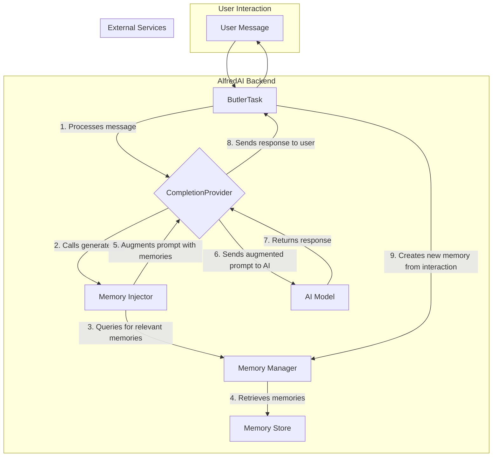

# Evolving Memory System Architecture

## 1. Overview

This document outlines the architecture for an evolving memory system for the AlfredAI assistant. The system is designed to provide the AI with a persistent, evolving memory that enables it to learn from interactions, recall relevant context, and personalize its responses.

## 2. Core Principles

*   **Modularity:** The memory system is designed as a set of loosely coupled components, allowing for independent development, testing, and replacement.
*   **Extensibility:** The system is designed to be easily extended with new memory types, storage backends, and retrieval strategies.
*   **Seamless Integration:** The memory system integrates with the existing personality and completion provider systems with minimal disruption.
*   **Privacy by Design:** User privacy is a core consideration, with features for data management and control built into the system from the ground up.

## 3. System Components

### 3.1. Memory Store

The Memory Store is the persistence layer for all memories. It is designed with a pluggable architecture to support multiple storage backends.

*   **File-based (Default):**
    *   **Technology:** JSON or YAML files.
    *   **Location:** `memory-bank/`
    *   **Use Case:** Long-term, structured memories that benefit from being human-readable and version-controlled.
*   **Vector Database:**
    *   **Technology:** Pinecone, ChromaDB, or a similar vector database.
    *   **Use Case:** Efficient semantic search and retrieval of conversational memories based on contextual similarity.
*   **Hybrid:**
    *   A combination of both file-based and vector storage, providing the benefits of both approaches.

### 3.2. Memory Manager

The Memory Manager provides a centralized API for all memory operations, abstracting the underlying storage mechanism.

**Key Responsibilities:**

*   **CRUD Operations:** Create, Read, Update, and Delete memory records.
*   **Retrieval Strategies:**
    *   `getById(id: string)`: Retrieve a memory by its unique ID.
    *   `findByTags(tags: string[])`: Retrieve memories by associated tags.
    *   `findSimilar(query: string, topK: number)`: Retrieve the top K most similar memories to a given query using vector search.
*   **Memory Evolution:** Update and refine memories based on new information.
*   **Forgetting:** Implement strategies for memory decay and explicit deletion.

### 3.3. Memory Injector

The Memory Injector is a middleware component that injects relevant memories into the AI's context before a request is sent to the completion provider.

**Integration:**

*   The Memory Injector will be integrated into the `CompletionProvider`'s `generateText` method.
*   It will query the `MemoryManager` for memories relevant to the current conversation.
*   It will then augment either the `systemPrompt` or the `conversation` history with the retrieved memories.

### 3.4. `memoryTool` (MCP Tool)

A dedicated MCP tool for explicit memory management by the AI.

**Actions:**

*   `remember(content: string, type: string, tags: string[])`: Create a new memory.
*   `recall(query: string)`: Recall a memory based on a query.
*   `update(id: string, content: string)`: Update an existing memory.
*   `forget(id: string)`: Forget a memory.

## 4. Data Flow



## 5. Data Structures

### 5.1. Memory Object

```typescript
interface Memory {
    id: string;
    type: 'fact' | 'preference' | 'goal' | 'short-term' | 'long-term';
    content: string;
    timestamp: string;
    lastAccessed: string;
    metadata: {
        source: 'user' | 'ai' | 'system';
        conversationId?: string;
        [key: string]: any;
    };
    tags: string[];
}
```

## 6. Technical Considerations

*   **Storage:** Start with a file-based system and integrate a vector database as the system matures.
*   **Privacy:** Implement user-facing controls for viewing, exporting, and deleting memories.
*   **Performance:** Optimize memory retrieval to minimize latency. Use caching strategies where appropriate.
*   **Scalability:** The modular design will allow for individual components to be scaled independently.

## 7. Implementation Roadmap

1.  **Phase 1: Core Infrastructure**
    *   Implement the `MemoryManager` with a file-based storage backend.
    *   Define the `Memory` data structure.
    *   Create the `memoryTool` with basic `remember` and `recall` functionality.
2.  **Phase 2: Integration**
    *   Implement the `MemoryInjector` and integrate it with the `CompletionProvider`.
    *   Begin augmenting prompts with simple, keyword-based memory retrieval.
3.  **Phase 3: Vector Search**
    *   Integrate a vector database.
    *   Implement semantic search in the `MemoryManager`.
    *   Enhance the `MemoryInjector` to use semantic retrieval.
4.  **Phase 4: Advanced Features**
    *   Implement memory evolution and forgetting mechanisms.
    *   Develop user-facing privacy controls.
    *   Refine and optimize the system based on usage data.